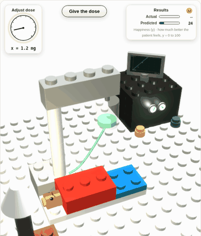
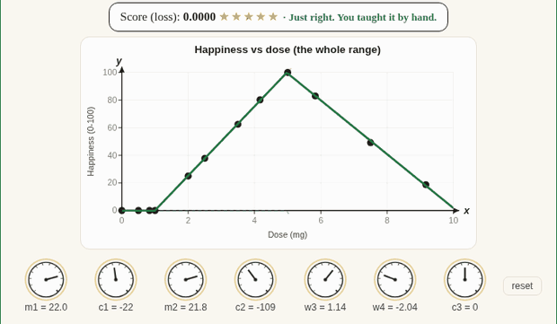
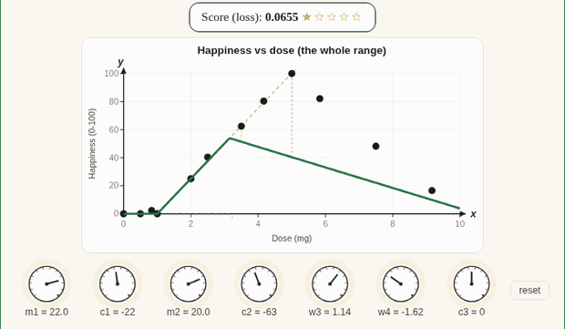
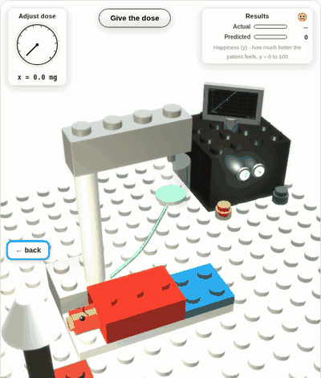
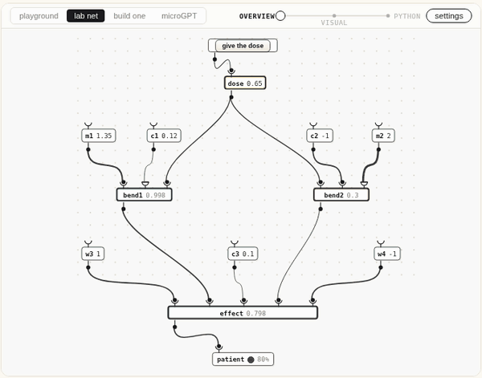
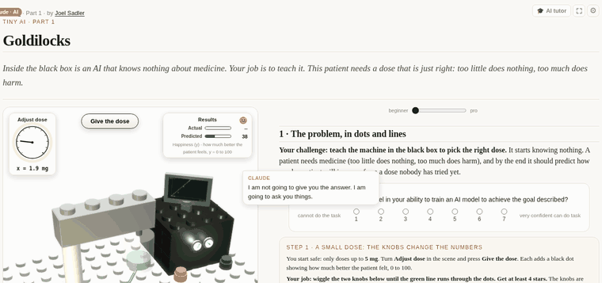

# Tiny AI

### Build a tiny ChatGPT from scratch, in a browser and a free Colab.

**Part 1 is the bootcamp: one to two hours, browser only, nothing to install. Parts 2 and 3 are
the rabbit hole: several hours each, on a free Colab GPU.**

| | |
|---|---|
| **The site** | **[claybits.xyz](https://claybits.xyz)** |
| **Part 1, the lab** | **[claybits.xyz/tiny-ai](https://claybits.xyz/tiny-ai)** |
| Staging, where changes land first | [claybits.xyz/staging/tiny-ai](https://claybits.xyz/staging/tiny-ai/) |

**By Joel Sadler** (joel.sadler@gmail.com ·
[scholar](https://scholar.google.com/citations?user=i2Wcl78AAAAJ) ·
[linkedin](https://www.linkedin.com/in/souljadler/)).
Co-created with Claude, using Claude Code and Claude Design (beta); every lab was built and
revised that way, which is also the course's thesis.

---

## What is actually at that URL

One HTML file. A patient, a dose, and a machine that starts out knowing nothing about medicine.
Your job is to teach it. You do that by turning knobs.



Turn the dial to pick a dose, press **Give the dose**, and the patient tells you how they feel.
That is one data point. Five of them and you have a scatter plot, which is where every machine
learning story really starts.


The green line is the model's guess. The dials under the graph are its **weights**, and there is
nothing else inside it: turning a knob is the whole of what "training" changes.



Then the reveal. Backpropagation is not a new idea, it is an **automatic hand** that turns the
same knobs you were turning, in the direction that shrinks the error. Press the button and watch
it do by itself what you were doing by hand.



The machine is a literal black box in the scene, and it comes apart.



Every diagram is drawn in **codon**, and every diagram morphs continuously into the Python it
stands for, because the point of the section is that they are the same object.



Finally, the lab can borrow **your** AI as a tutor. Paste the URL into Claude or ChatGPT and it
reads a briefing hidden in the page, then teaches Socratically: it gets a labelled cursor, it can
highlight text on your screen, and it can see what you are hovering. It cannot click, type, or
change your work.



---

## Who this is for

Anyone with light Python exposure and a free Google account: first-year undergrads, data-science
students, working scientists, curious adults. No CS degree, no GPU, no setup. If every citizen
needs to speak a little AI, Part 1 is the phrasebook you can finish in one sitting, taught by
building the real thing. Parts 2 and 3 are there for when one sitting is not enough.

## The signature idea: train together

Tiny AI is built for teams. A table of four shards the data, trains in parallel on free Colab
GPUs, then merges weights: the merged model is better than any solo model and four times faster
to reach. The fast finisher's only path to the leaderboard is helping teammates finish. Part 1
previews the mechanic in-browser; Parts 2 and 3 do it with real GPUs through a shared Drive
folder.

## The arc (magic in the first minute, epiphany in the first five)

1. **Part 1: "Goldilocks"** (browser, zero install, one to two hours). One neuron doing a real
   job: deciding whether a dose is too low, too high, or just right. You train it yourself with
   rotary knobs (no sliders; knobs, like a synthesizer) and watch the loss drop. Then
   backpropagation arrives as the automatic hand. Hover anything, a knob, a wire, a term in the
   equation, a line of code, and every representation of that same weight lights up together.
2. **Interlude: "Forbidden Fruit"** (the alignment game). Your tiny chatbot must never talk about
   fruit. Write a plain-language spec, let AI generate the filter code. Score 1 to 5 stars against
   a hidden test set that punishes both letting fruit through **and** paranoid over-blocking
   (innocent sentences about Apple Inc. and grapefruit leagues must pass). Rules that are too
   loose fail; rules that are too tight also fail.
3. **Parts 2 and 3: microGPT, then nanochat** (free Colab GPU, several hours each). Build microGPT
   from scratch, then train a small GPT on a real dataset inside a free Colab session,
   checkpointing to your own Drive so a timeout never costs you the run.

## The visual language: codon

Every network diagram in these labs is drawn in
**[codon](https://github.com/grassyhilltop/codon)**, a minimal visual programming language by the
same author ([live playground](https://grassyhilltop.github.io/codon/)). It has three atoms: a
**cell** (a name and one line inside it), a **wire** (which fills in one of a cell's arguments),
and a **gate** (the only conditional). A neuron is not a special block: it is a cell whose one
line happens to be `relu(m * x + c)`. codon has an isomorphism slider that morphs the drawing
continuously into the plain Python it stands for.

The vocabulary is **borrowed metaphor, not subject matter**. A cell is a box holding one line of
code; a wire fills in one of that cell's arguments; the editor's internal names for a cell's
input and output ports (synapse, axon) come from the same borrowing. The names give novices a
concrete picture for an abstract idea. Neither codon nor these labs are about biology.

codon stands on its own as a language project; you do not need these labs to read it, and it does
not need these labs to be useful.

## Bring your own AI

The lab does not ship an AI and does not have a server. It borrows the one the reader already
has. Three ways in, in order of friction:

1. **Paste the URL** into Claude or ChatGPT. A hidden block at the top of the page points any
   model that reads the page at [`staging/tiny-ai/AGENTS.md`](staging/tiny-ai/AGENTS.md), the
   tutor briefing: the Socratic rules, the section map, the model internals, the section 5 rubric.
   The reader then pastes the AI's replies back into the page's box, and any ` ```aitutor ` block
   in them drives the cursor and the highlighter.
2. **A live bridge**, [`staging/tiny-ai/tutor-bridge/`](staging/tiny-ai/tutor-bridge/): a
   zero-dependency Node relay speaking MCP over streamable HTTP. Nothing on the page contacts it
   unless the reader types its URL, and rooms expire after an hour.
3. **Voice mode**, which is just (1) with the phone talking.

What the AI can do is deliberately bounded, and the bound is enforced on the page, not in the
prompt: it can **point, highlight and talk**. It cannot click, type, or change the reader's work.
The knowledge check in section 5 is never graded by the page; the reader's own AI grades it,
against a rubric the page hands over.

## Repository layout

```
index.html                    the landing page (GitHub Pages serves this)
tiny-ai/index.html            Part 1, live. One self-contained file, about 215 KB
staging/                      WHERE WORK HAPPENS. Edit here, then ./promote.sh
  tiny-ai/index.html            the lab
  tiny-ai/ai-tutor.js           the BYO-AI presence layer (cursor, highlighting, context)
  tiny-ai/AGENTS.md             the tutor briefing every LLM reads
  tiny-ai/tutor-bridge/         the optional live MCP relay
  tiny-ai/SURVEY.md             the pre/post measures and the timing telemetry
labs/_shared/codon.html       the embedded codon editor
forbidden-fruit/              the alignment game: spec, starter prompt, grader, hidden test set
colab/                        the Part 2 and 3 notebooks
bin/probe/                    headless-Chrome measurement and QA harness
docs/qa-reference/            the QA keyframes to compare a build against
docs/img/                     the clips in this file
CLAUDE.md                     read this before touching anything
QA.md                         what to run before pushing, and why each check exists
ANALYTICS.md                  where the completion and feedback events go
CREDITS.md                    other people's work, checked against primary sources
```

## Working on it

Everything is static files. There is no build step and no server of ours.

```bash
python3 -m http.server 8783          # from staging/, then open localhost:8783/tiny-ai/
./promote.sh --dry-run               # staging/ to the site root; ALWAYS dry-run first
```

Before pushing to `main`, run the QA in [`QA.md`](QA.md). It is two levels, about 80 seconds and
about 2.5 minutes, and every check in it exists because something broke once.

**[`CLAUDE.md`](CLAUDE.md) is the file to read first.** It is the accumulated list of things that
will bite you: the saved-settings trap that pins returning visitors to old defaults, why
`promote.sh` needs a guard, why the render loop cannot go back on `runRenderLoop`, and why SSAO2
is not coming back.

## Status

Early public fork, started July 13, 2026. Part 1 is a working v1 and has been through user
testing. The Forbidden Fruit grader is v1. The Colab notebook is a scaffold being adapted from the
UVA HPC version (main changes: Drive-mounted checkpoints and pip cache, model scaled to free-tier
GPU session limits).

## Lineage, license and attribution

This is an experimental public adaptation of Labs 2 and 3 of **DS 6042** at the UVA School of Data
Science by **Prof. Daniel Graham**, whose microGPT-to-nanochat lab design is the best
zero-to-hero ML on-ramp I have seen. It was rebuilt from scratch and carries none of that course's
git history; the lineage lives here and in [`CREDITS.md`](CREDITS.md) instead.

Pedagogical inspirations, with gratitude: **Andrej Karpathy** (nanoGPT, the from-scratch ethos),
**StatQuest / Josh Starmer** (tiny networks on real problems), **Welch Labs** (geometric
intuition), **3Blue1Brown** (visual math). Only the two general machine-learning labs are adapted
here; the rest of the original course is outside the scope of this site.

The lab frames itself around **AI Fluency** and quotes the **4D framework** by **Prof. Rick Dakan**
(Ringling College) and **Prof. Joseph Feller** (University College Cork). Both 4D documents are
NonCommercial, and the longer one is NoDerivatives. [`CREDITS.md`](CREDITS.md) has the details and
the two attribution traps that were nearly published wrong.

If you build on this, keep the attribution chain intact.
